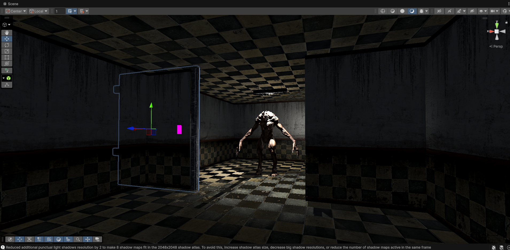
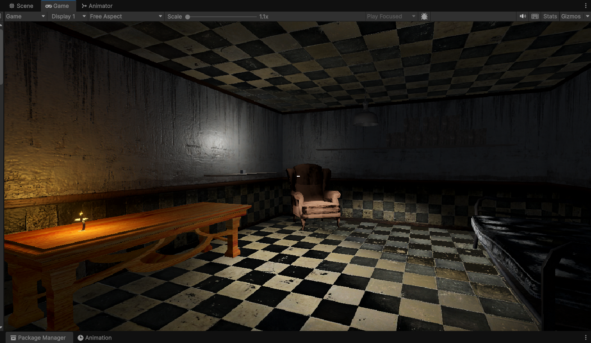
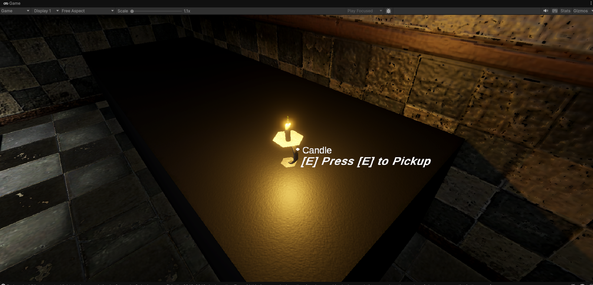
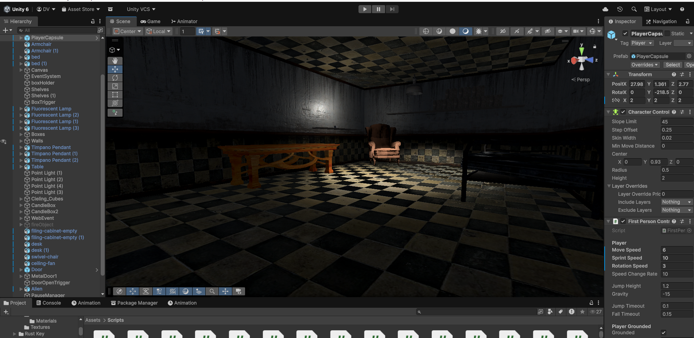
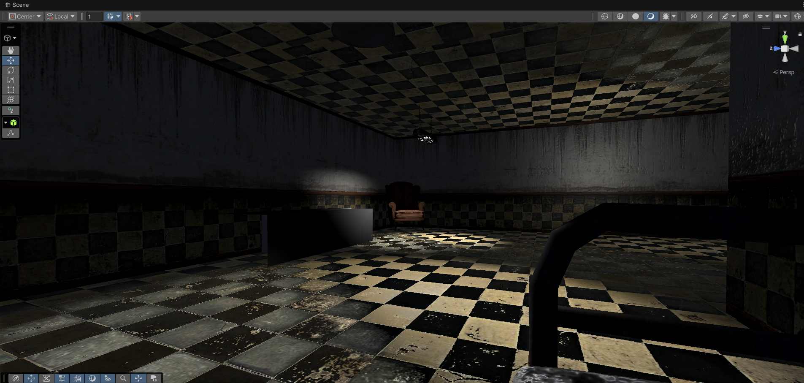
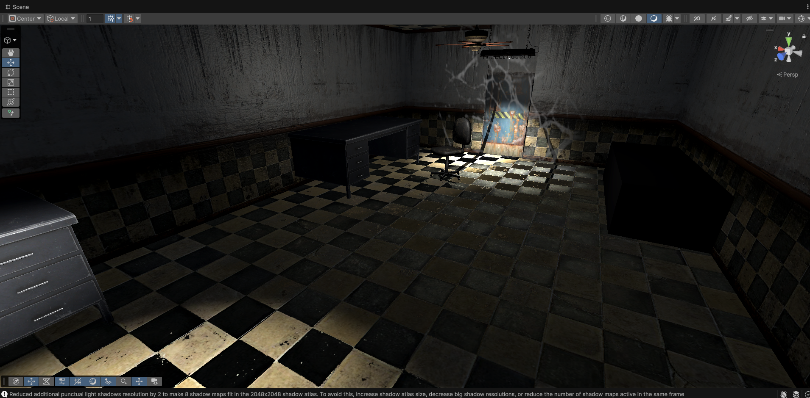
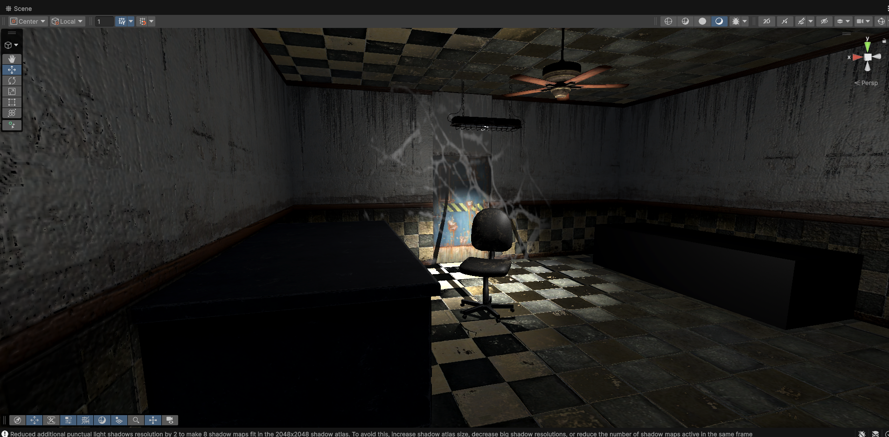
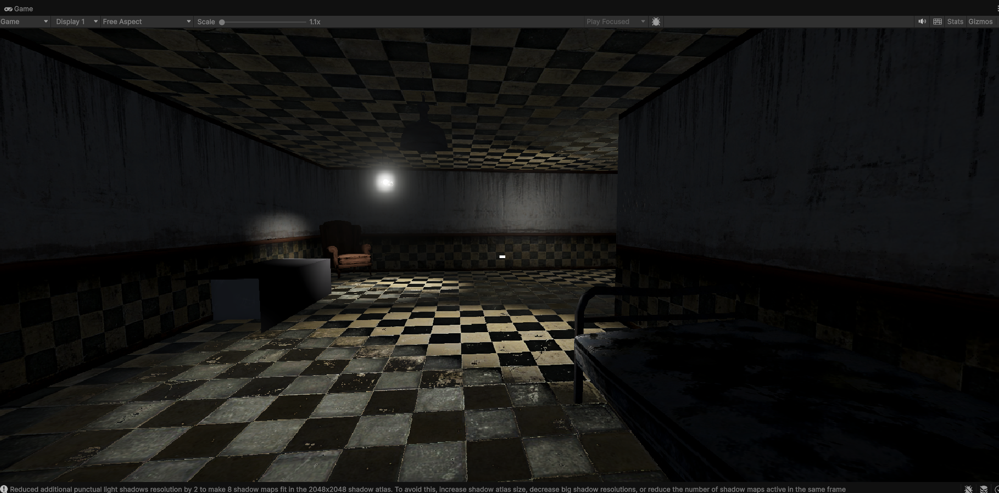
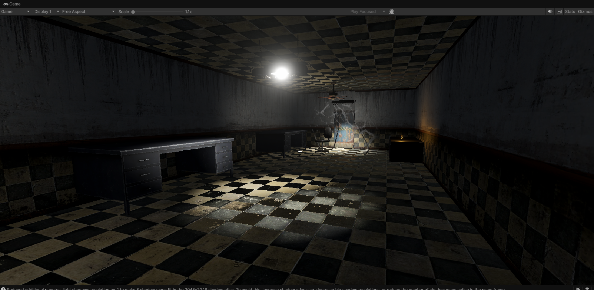
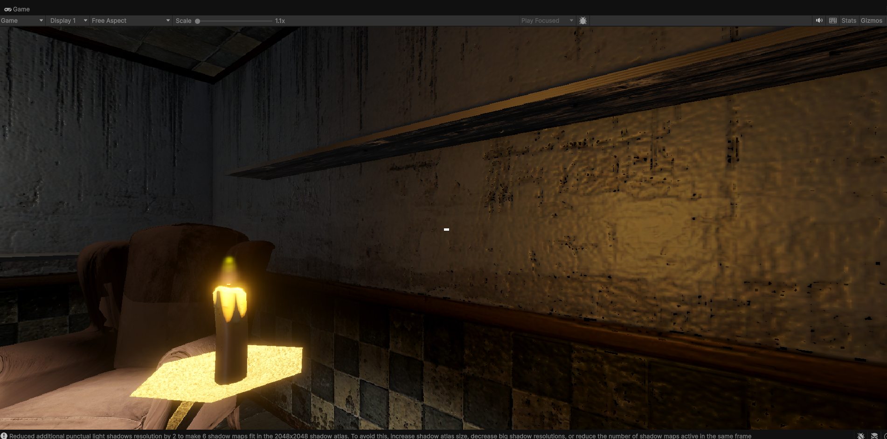

# Horror Survival Game

A first-person horror survival game developed using **Unity 3D** and **C#**, where players explore a dark and mysterious environment while avoiding deadly threats, solving challenges, and managing limited resources to survive.

## 🎮 Overview

The game focuses on creating an immersive horror experience through atmospheric environments, suspenseful gameplay, and survival mechanics. Players must carefully navigate through the game world, uncover clues, and make strategic decisions to stay alive.

## ✨ Features

* First-Person Horror Gameplay
* Interactive Environment Exploration
* Dynamic Lighting and Atmospheric Effects
* Enemy AI and Chase Mechanics
* Survival and Resource Management System
* Audio Effects and Ambient Sound Design
* Object Interaction System
* Game Over and Restart Mechanics
* Pause Menu and Settings System
* Optimized Performance for Smooth Gameplay

## 🛠️ Technologies Used

* Unity 3D
* C#
* Unity Editor
* Blender (3D Assets and Environment Design)
* Git & GitHub

## 🧩 Core Concepts Implemented

* Object-Oriented Programming (OOP)
* Component-Based Architecture
* State Management
* Physics and Collision Detection
* Animation System
* Scene Management
* Event Handling and User Input Processing
* Game Optimization Techniques

## 📂 Project Structure

Assets/
├── Scripts/
├── Prefabs/
├── Scenes/
├── Materials/
├── Models/
├── Animations/
├── Audio/
└── UI/

## 🚀 How to Run

1. Clone the repository:
   git clone https://github.com/devverma4572/Horror-Game

2. Open the project in Unity Hub.

3. Use the recommended Unity version.

4. Open the Main Scene.

5. Click Play in the Unity Editor.

## 📸 Screenshots

## 🎯 Learning Outcomes

* Built a complete game using Unity 3D and C#.
* Gained hands-on experience in gameplay programming and game architecture.
* Learned environment design, lighting, and audio integration for horror experiences.
* Improved problem-solving, debugging, and optimization skills in game development.

## 👨‍💻 Developer

Dev Kumar

Aspiring Game Developer | Unity 3D Developer | C# Programmer | Blender Artist | Computer Science Engineer
